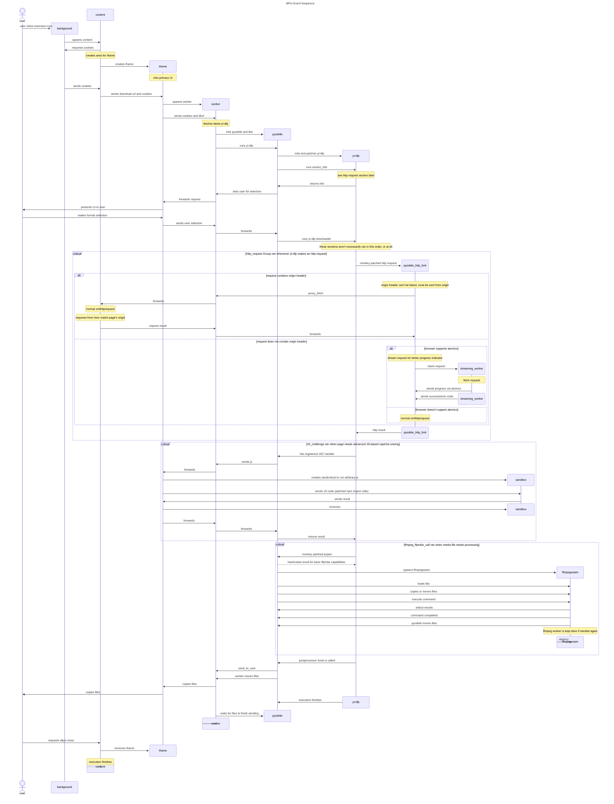

#  dlPro
yt-dlp, the web's most powerful video and audio downloader, now embedded fully in your browser.

If you can name the site, dlPro can download from it! Download maximum quality audio and video from your favorite websites, with zero dependence on external servers.

## Get it
  

### Rejected
Due to the nature of dlPro (being able to download content from sites that may not want you to), some web stores have rejected dlPro. Below is instructions for those browsers.

Above is also applicable to other Chromium browsers like Opera and Brave.

# internal workings

dlPro is a very complex program because of the intricacies of web [content security policy](https://developer.mozilla.org/en-US/docs/Web/HTTP/Guides/CSP). tldr different sections of the program (iframes, sandboxes, workers, wasm, etc) can do different things, and execution has to constantly pass between them to accomplish everything.

I created a full UML sequence diagram for those curious:

[UML sequence diagram online](https://sequencediagram.org/index.html?presentationMode=readOnly&shrinkToFit=true#initialData=C4S2BsFMAIBNwAoCcD20CiA3SA7Y0BlSARwFdcBjSAKFoEMLgUlpSBnSJa9zgWgD4ARgwDWAc1SkcsAFysOLCuBAURbaJAAewXGxAoc0FQerDVElFNgCAVBQM68ctgAc6Adxzr7eXMGo+jsACZuKS0nJIJORswN4oKCIgkGymKJrQKNiKDn4yFFF0Oup0hdAAZsxG5Uh0ALY0gX62IDX1kHIFkEUp1bUN1G5IoBQgbnjQbHTSgulpGVmcfe0yIDhg6i5IIHWlAJ7QAKoAkqaiFlYCTU4c0vGJyWwAOjgBuXgCrf0dt7DqsChPOAUHRYKwkOBoNMwfYHilqF92rZ3MwRJxnG5POoUUg0VxEQ0BDi8c5cH9oLCkr1oXBwKQIfNMtloMT0eVIMAKAALXrgHqxaB7YLwFzUVlIWwuPYoWAgWAdNYbaBSmVymA05SCVJDEZjab4crlOouSBidx0Nh1MWovj8FWy+UyJBSdRC3giwbSh2QWxukWrdZxKHSZVFbm9P3gUX2tUCSMuJ0ujTaWqMAD6a0q1Ci5SZS3jMg4MC5wGALmgUTIKXwHEY+kMfJ0XHjAhjjqiwHpXiMOCzbZ9-HFMgtankS0qLA4UDrJnFnzaDRkE-NSHJlZi-gJA54SBkWxSfnUJ2gTDHXB38++Ml2aPUE92Ncg09AJi3RJtu9+6h3kyfkBnrxznaXpqkuzArn8nqqvKcbClGibdvGcCAjgwKgpw1A4CgOh5iwBbADyHC-gBJRRDgADk+A4P+KRTNs4AHLUhhrCeXIgOozDykgAA0mQsEUULgOA1AXOWJZlhW0TVtAADaTEsjy1HMkhN7UoY4nluu1YALrUC2-A2P2aYaWmE4iNeBhogcbicjyYIaZJVaxNQdDgPgWkCoEdBrBx2xiCxPLoVwWE4YsLBGSZZlyMwID+ep3RcRS0yUdAggwOUdBorAvF1Ow+Bpb+Ew1CgdR8bFaxQd6xmli4pmou+uLols6R7KZHLctajUSvw1zAGBSAQakswLMyvUyFhSC7JCmh1OAGkef4IUwGFFLvH1C13qgpU8lE0APtyoZiJA5G+eVry9Q1JILZJbCkG5nV4q2IHytVZZ1bi-WDdQT5EddAK9CFq14N5hgxXF0CBVxLlualqDuAokykC4LjMEGRQlSoqRLbhyrPZAr21VFsSFKV10TqlHJNsqqASLRPayhQ6NcBFNXvSItjE90dRrGILIfoWwClEGC2MitnP1DzfNdUu7Vco5G7UOL3M4LzQEs29RNkpsNNRGw6iYCAdBQkw3MUKkSuS2reME2zhZa4jFBUHrAD0nCoDk8rUPKxMoHsdDlFTFsq1LeLfeARGCHDCP-WwFE1kjKPDMbGNm6LzLq4TqLjcwU3QDNc01SLZLfdIlVqjbZmwe68EObrd3+N7wCoHsehQBMGdsyXsAiZI5YAFIEBSXKuW3R2yfJ7iKYdMDUZA5Kgpg0xUGCA+8MIHAwnQLi2UbbAoOABsq7pelwS4T3QR0bHC6a7FNnP0ADwAwhD0JQMzeOXeiX7QAAVqkQFbk+qUSCb4DJTBmOkfIhRiiTGhMNE8aBnSGFKIIMAtQkAHD-giBcA5wGwGGnbO4D9B72HlNAAAFDZcMYIcAuFKjsRO+BGZCTYAASkVnA9Il4VjfzrvdUBeCCFRDqIsVIjdm6wIgZobB3xP67mXMA-+H5z7eiAaubUH9+AFg7F2dQfD-Bd1oKJCoRoTRiGdoaZqBVmGQjktMBSuA9pz0NhUEAUBoCz3JM1J2egj4n2rmfYCF8LI4CsqGWy98UYmleP2XgVd-TD1XKQ+++iKhVHXioExViYCMzcKg5QoB4SxIMoaY0ppzSWkLJibspSzEVKtMU2p5SLR1BkGhckmoNEXwEE0s0LT8goBcI8Pie1RGuKgF070PTTHNMqVof8pAcL2DqLsUuvT6kqNArEAEiybr11SOslpmzHTLNWTCEqLgoA6G7ocy0xyOj9lGdgO8bj4TwJWrc1pvSQ5LHYtANE29BIgGwNUDxkA573zoGIEGXtqzN1bn4ExZS+mWkMf4kU9y9woFiN42iVQuQJBEEYbwI855lxgoOfmvw0xMDTDuclA4hziieb0corylFdW4YuewQzWXspkUifgO4Bm8peRM9FUZMXzIoIs+srj1hsEIrCn2fsA75lPg9W0-YZDmiVOTNlEyEHyvYnLX4PNlVN19v7Km-YLUSPFNwBQVw1pOikrEf4UZUAUmBBwN4vgPj8EAcIsZW47VWrVSwUN7zRouulbKgwxrFXwnEb7BFExepAA)

[UML source](dlpro%20uml.txt)

