# How to install dlPro on Chrome

## Why?

dlPro is capable of downloading YouTube videos, and YouTube downloaders are not allowed in the Chrome Web Store.

## What if I don't want to?

The extension is published on
the [Edge](https://microsoftedge.microsoft.com/addons/detail/dlPro/cedeagppabppeogffgefpinjbkheccci)
and [Firefox](https://addons.mozilla.org/en-US/firefox/addon/dlpro/) stores, you can use Edge or Firefox.

## Notes

You will need to repeat these instructions on each device it's installed on, and updates will not be automatic, see the
[update instructions](#instructions-to-update).

## Instructions to install

1. Download the extension .zip file from [releases](https://github.com/machineonamission/dlpro/releases/latest)

   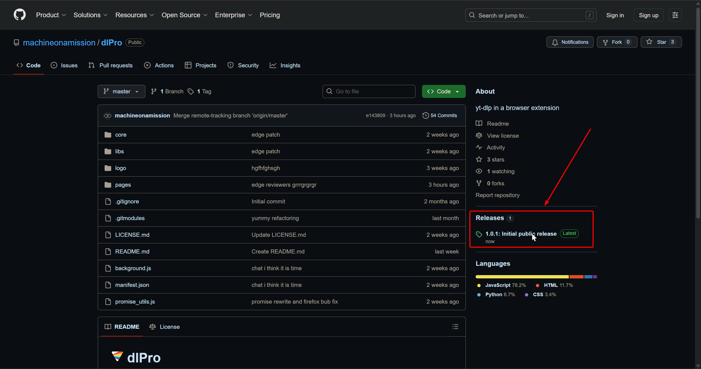

   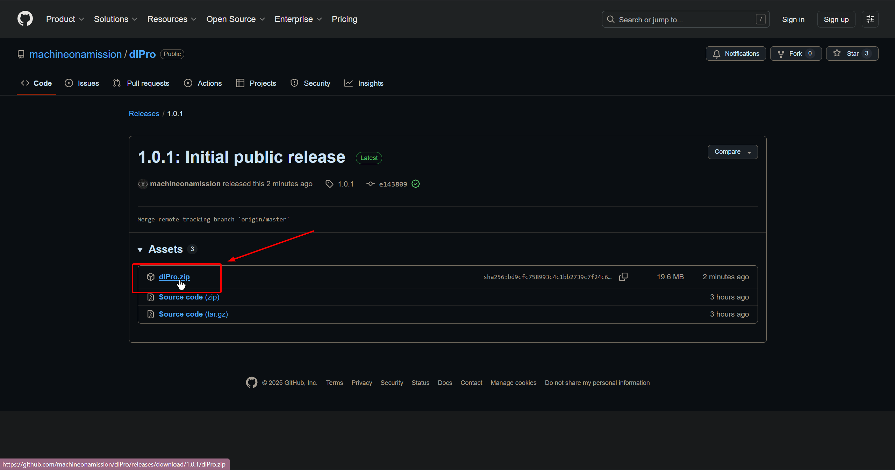

2. Unzip the .zip file somewhere on your computer where it can live.

   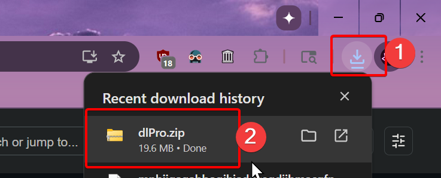

   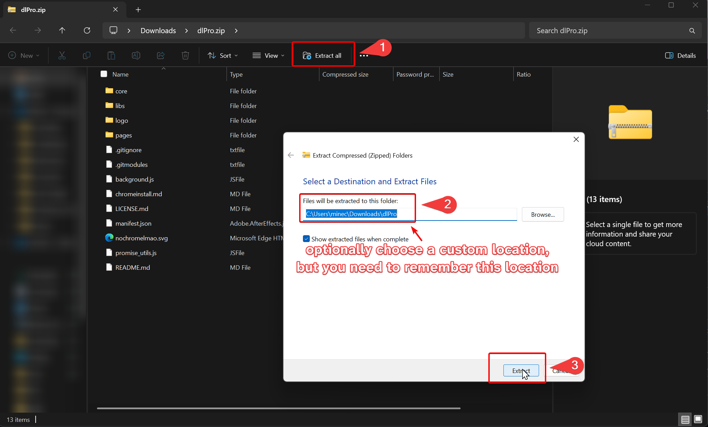

3. open the extensions page (`chrome://extensions`)

   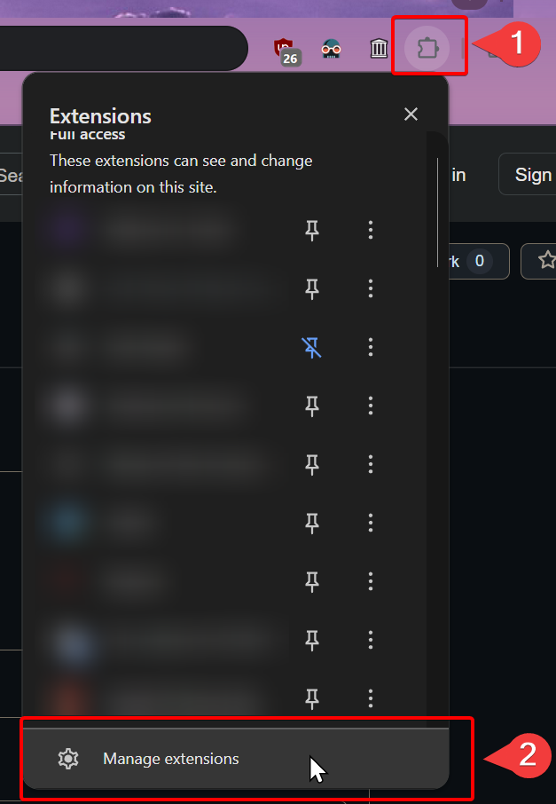

4. turn on developer mode

   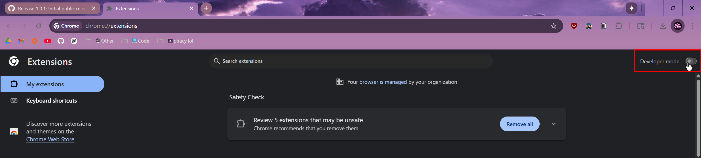

5. click "Load unpacked"

   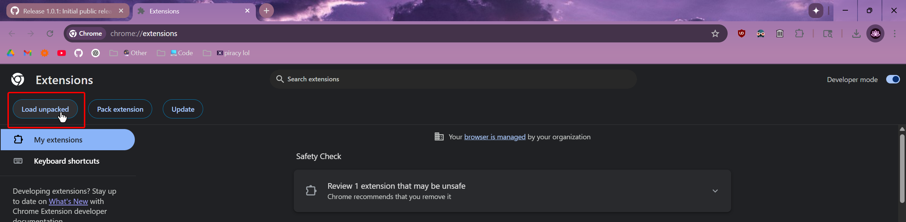

6. navigate to the folder where dlPro was unzipped in step 2, and click "Select folder"

   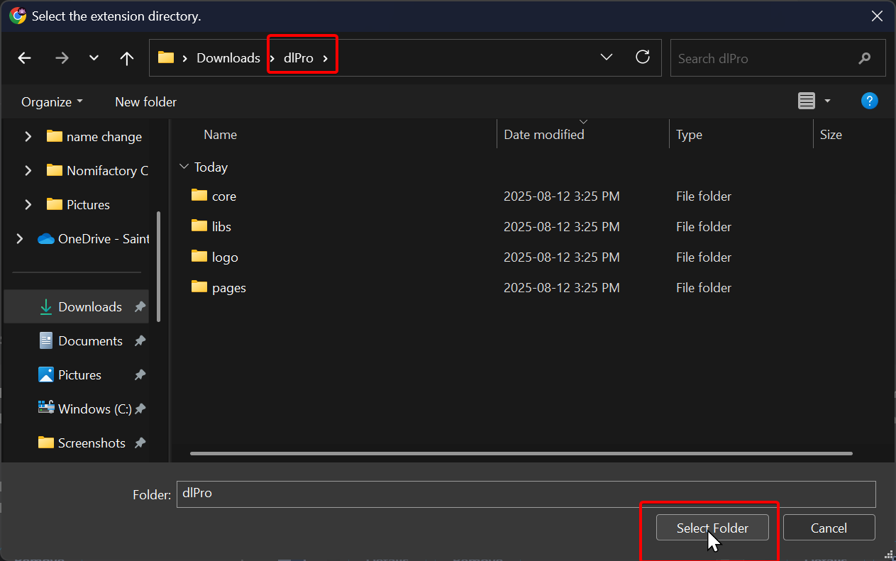

7. Congratulations! dlPro is now installed!

   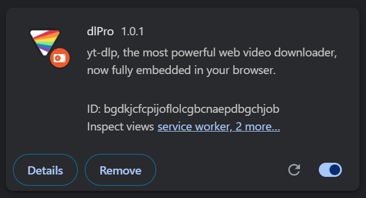

## Instructions to update

1. Download the extension .zip file from [releases](https://github.com/machineonamission/dlpro/releases/latest)

   

   

2. Unzip the .zip file **to the same location you unzipped it when you installed it**
   
   

   

3. Select "replace all"

    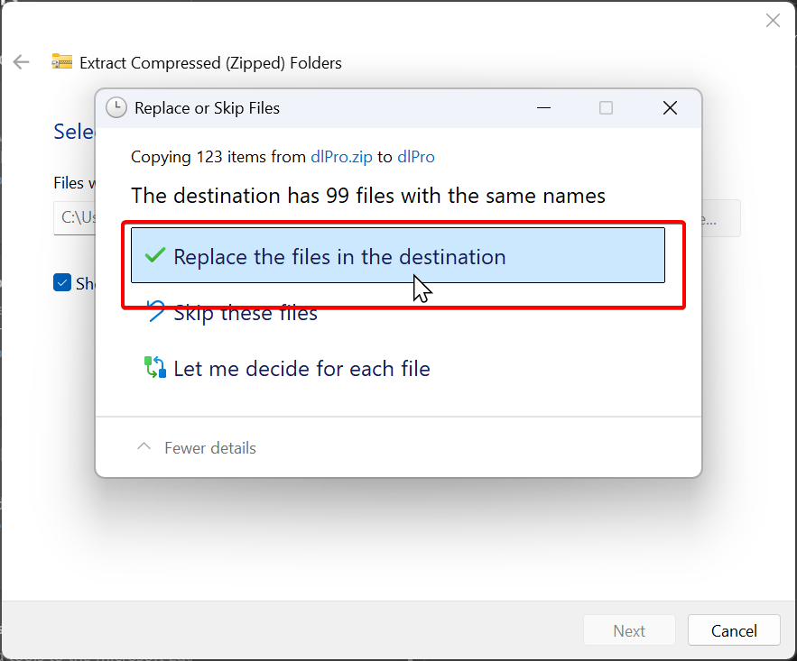

4. open the extensions page (`chrome://extensions`)

   

5. click the 🔄 button (reload)

    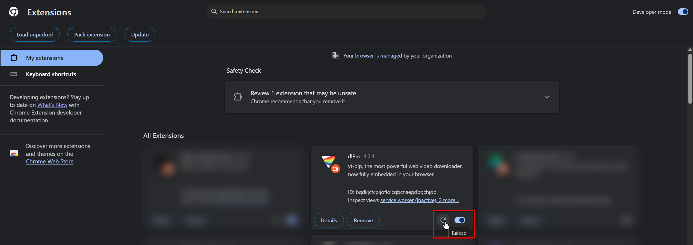

6. Congratulations! dlPro is now updated!
